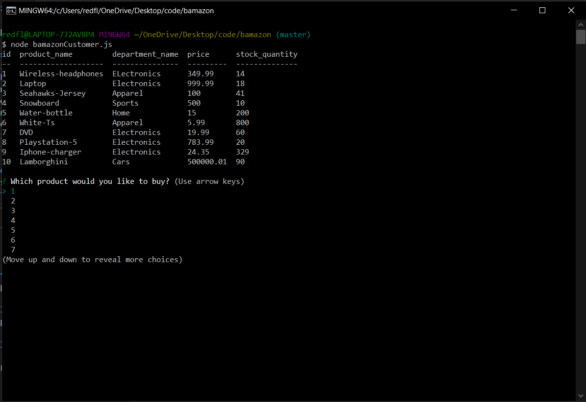
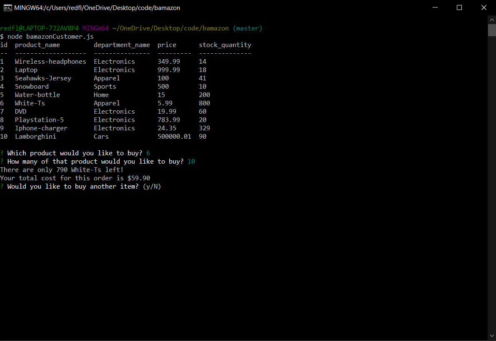
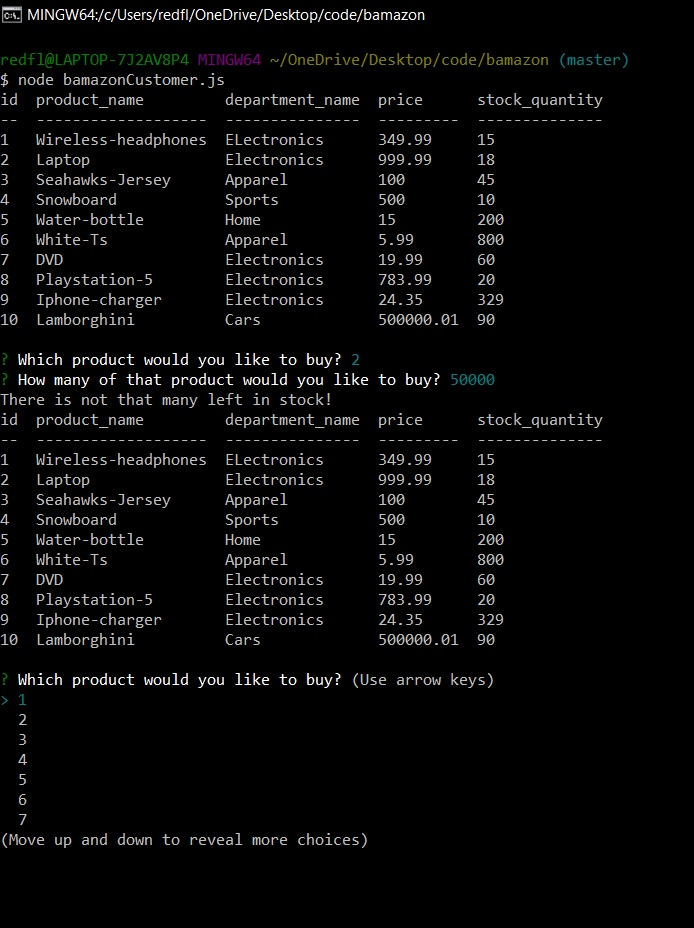

# bamazon

This app was designed to show control of MySQL databases.

**To use this app**
1. navigate to the folder its stored in and run a node bamazon.js.
1. Look at the products and take note of the stock quantity.
1. Using the arrow keys select the product you would like to purchase.
1. After selecting a product enter the number you would like to buy.
1. Then an updated stock count will print as will your total cost for that order.
1. After your total is displayed you will be asked if you would like to purchase another item.
    * if yes is selected you will see the table printed again with updated stock counts.
    * if no is selected (default) the app will end.

## Screenshots
This is what you see after running node bamazon.js:

This is the screen after selecting an item and buying an ammount that is in stock:

Selecting a quantity higher than instock returns a message saying not enough and letting you select again:

**Link to watch it in action** **https://drive.google.com/file/d/1n5sW2uZpFmBr6rV9SE3P2TIrVZ97bagN/view**

## Installation 
This app requires a npm install of node

## Deployment 
This app has no front end so its ran in the local users console. 

## Built With 
* Node.js
* MySQL